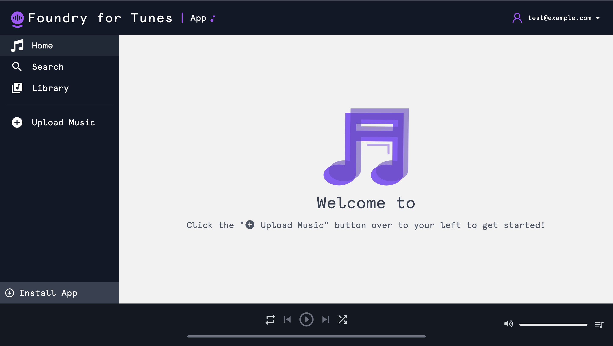

# Foundry for Tunes



Welcome to the Foundry for Tunes repository 🎵

## About

Foundry for Tunes (FfT) is a cloud music hosting and streaming service for your personal audio file collection built on top of AIP.

## Tech

Foundry for Tunes is built using [React](https://reactjs.org), [Tailwind CSS](https://tailwindcss.com), [Vite](https://vite.dev/) and [AIP's Ontology SDK](https://www.palantir.com/docs/foundry/ontology-sdk/overview/).

## Developing

Run the following command or equivalent with your preferred package manager to start a local development server on `http://localhost:8080`:

```sh
npm run dev
```

Development configuration is stored in `.env.development`.

In order to make API requests to Foundry, CORS must be configured for the stack to allow `http://localhost:8080` to load resources. If this has not been configured and you are unable to request this, you can alternatively generate your project again with `--corsProxy true` to use a proxy for API requests during local development. The configured OAuth client must also allow `http://localhost:8080/auth/callback` as a redirect URL.

## Deploying

Run the following command or equivalent with your preferred package manager to create a production build of your application:

```sh
npm run build
```

Production configuration is stored in `.env.production`.

If you did not fill in the URL your production application will be hosted on you will need to fill in the `VITE_FOUNDRY_REDIRECT_URL` in `.env.production`. A default test is included in `env.test.ts` to verify your production environment variables which you can enable by removing the skip condition or running tests with the environment variable set `VERIFY_ENV_PRODUCTION=true`.

In order to make API requests to Foundry, CORS must be configured for the stack to allow the production origin to load resources. This will be automatically done for you if you are using Foundry website hosting. The configured OAuth client must also allow the production origin auth callback as a redirect URL.

A `foundry.config.json` file is included in the root of this project to make deploying to Foundry website hosting with [`@osdk/cli`](https://www.npmjs.com/package/@osdk/cli) easier. If you are not using Foundry website hosting for your application you may delete this file.
